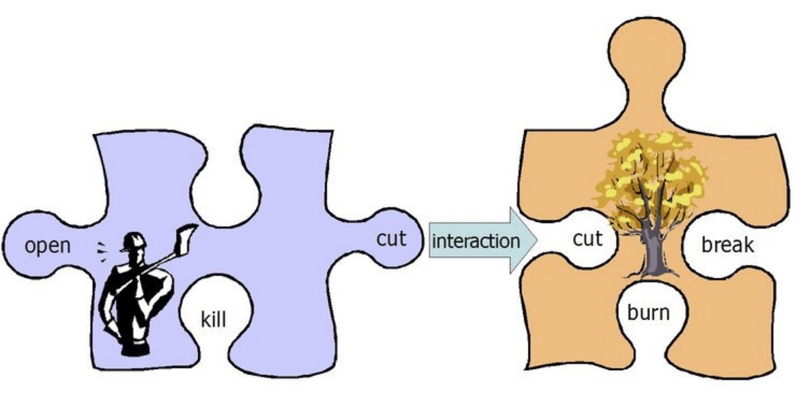
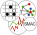

IODA for NetLogo
================

Authors
-------

- Sébastien PICAULT
- Nathan HALLEZ 
- Philippe MATHIEU

Download and install
--------------------

The IODA NetLogo package can be downloaded from [this page](https://github.com/cristal-smac/ioda), either as a zip file or through `git`.

To install the IODA NetLogo extension for use by any model, place the `ioda` directory either in the extensions directory in the NetLogo directory, or in the same folder as the model that uses it. 

For more information about other ways of installing an extension, please refer to the
[NetLogo Extensions Guide](https://ccl.northwestern.edu/netlogo/docs/extensions.html).

In order to use the IODA simulation engine, your NetLogo code must include the file named `IODA_3_0.nls`. Thus, if the IODA folder is installed in the NetLogo directory, it could be useful to put a copy of this file (or a symbolic link) next to your own NetLogo model, in order to use a relative path instead of an absolute path.

Getting started
---------------

> See the [Tutorial](doc/IODA-NetLogo-Tutorial.html) for a comprehensive, step-by-step guide of using the IODA methodology within NetLogo simulations.
> You can start with Tutorial #0 ("Template"), copy the directory, and adapt it to your needs.

Open any folder in the [tutorials](tutorials) directory, double-click the `model.nlogo` file, read the "Info" tab, test features in the interface, look at the code !...

What is it?
----------

This software is an extension for [NetLogo](https://ccl.northwestern.edu/netlogo/) (Wilensky, 1999), version 6 or above (tested with NetLogo 6.4).

The IODA NetLogo extension provides NetLogo users with many features of the <a href="https://cristal.univ-lille.fr/SMAC/projects/ioda/">IODA Methodology</a> &ndash;
"IODA" stands for "Interaction-Oriented Design of Agent simulations"
(Kubera *et al.*, 2008, 2011).

The IODA approach aims at simplifying the design and reusability of individual-based or agent-based simulations.
It relies upon the following key ideas:
- The **declarative** parts of the model should be separated from the **procedural** parts as far as possible.
  - declarative parts include the nature of the agents and how they can interact
  - procedural parts include essentially the simulation engine (scheduling, action selection algorithms&#x2026;)
- Thus, any relevant **entity** of a model should be represented by an **agent** (Kubera *et al.*, 2010).
- Any **behavior** is encoded through a generic rule called an **interaction**. Basically, an interaction is a condition/action rule involving two agents: a source that *performs* the interaction and a target which *undergoes* it. Interactions must be designed independently from the specificities of agents (and vice-versa).
- The matching between agents and interactions is ensured through:
  - an **interaction matrix** which indicates what interactions an agent may perform or undergo, and with what other agents
  - a **generic simulation engine** which asks potential source agents
    to select and perform an interaction and a target agent.

*Example of two agents and the interactions they can perform or undergo*

Thus the design of an individual-based model is split into three main tasks, through a top-down process:
1. write the interaction matrix: who can do what with whom ?
2. describe the interactions i.e. each behavioral rule
3. write the elementary capabilities of the agents i.e. small code primitives

The goal of this extension is to allow NetLogo users to get familiar with the IODA approach, and use it within their models, for research or educational purpose.

For more information on the IODA approach, please consult the [IODA NetLogo Tutorials](doc/IODA-NetLogo-Tutorial.html), the
[IODA webpage](https://cristal.univ-lille.fr/SMAC/projects/ioda) and the research papers mentioned below.

Developing an interaction-oriented model with IODA NetLogo
------------

The main usage pattern of IODA in NetLogo models is as follows: The user creates a model for the problem to study, according to the IODA methodology (Kubera *et al.* 2011). A IODA model is composed of the following elements:
- A list of **agents**: those agents are supported by NetLogo turtles (or user-defined breeds) and patches; they can be endowed with their own variables and reporters/commands;
- A list of **interactions**: an interaction is a condition/actions rule, which captures the abstract features of a behavior; it involves *source agent* (which *perform* the interaction) and one (or more) *target agents* (which *undergo* the interaction). The definition of interactions can be done manually in the NetLogo program, but you are recommended to describe them in a text file, like in the tutorial examples.
- An **interaction matrix** and an **update matrix** which specify how interactions are assigned to agents. The update matrix contains interactions that each agent tries to perform in the beginning of a simulation step. The interaction matrix specifies what interactions an agent *X* may perform over an agent *Y*. Here again, you are recommended to write those matrices in a text file (CSV format), like in the examples.
- A list of **agent primitives**: these primitives are reporters and commands that will be evaluated or run by the agents when trying to perform or undergo interactions. Interactions are written using *abstract primitives*: thus, agents must implement *concrete primitives* according to the interactions they can perform or undergo. For instance, if agents of the breed *wolves* can perform (i.e. be the source) of an interaction that contains the abstract primitives `hungry?` (in trigger/condition) and `follow` (in actions), then two concrete primitives must be written: a reporter named `wolves::hungry?`, and a command named `wolves::follow`.

The IODA NetLogo extension provides tools for checking the consistency of a model, i.e. to ensure that all concrete primitives have been written with respect to the definition of interactions, the interaction matrix and the update matrix.

After defining those items, you have to write a `setup` procedure to initialize your simulation and a `go` procedure to run it. If you simply want to make use of the predefined IODA simulation engine, just put <code>ioda:setup</code> at the end of your `setup` procedure, and `ioda:go` at the beginning of your `go` procedure. That's all!

References
----------

Y. KUBERA, P. MATHIEU and S. PICAULT (2011), ["IODA: an interaction-oriented approach for multi-agent based simulations"](https://doi.org/10.1007/s10458-010-9164-z), 
in: *Journal of Autonomous Agents and Multi-Agent Systems (JAAMAS)*,
vol. 23 (3), p. 303-343, Springer DOI: 10.1007/s10458-010-9164-z.

Y. KUBERA, P. MATHIEU and S. PICAULT (2010), 
["Everything can be Agent!"](https://hal.science/hal-00584364), 
in: van der Hoek *et al.* (eds.),
*Proceedings of the 9th International Joint Conference on Autonomous 
Agents and Multi-Agent Systems (AAMAS 2010)*, Toronto, p. 1547-1548.

Y. KUBERA, P. MATHIEU and S. PICAULT (2008),
["Interaction-Oriented Agent Simulations: From Theory to Implementation"](https://hal.science/hal-00731987/),
in: M. Ghallab, C.D. Spyropoulos, N. Fakotakis, M. Avouris (eds.),
*18th European Conference on Artificial Intelligence (ECAI'08)*,
Frontiers in Artificial Intelligence Applications, IOS Press, 
p. 383-387, ISBN 978-1-58603-891-5.

P. MATHIEU and S. PICAULT (2005),
"Towards an interaction-based design of behaviors", in: M.-P. Gleizes (ed.),
*Proceedings of the The Third European Workshop on Multi-Agent Systems (EUMAS'2005)*.

U. WILENSKY (1999), 
*NetLogo.*  [https://ccl.northwestern.edu/netlogo](https://ccl.northwestern.edu/netlogo)
Center for Connected Learning and Computer-Based Modeling,
Northwestern University.  Evanston, IL.

License
-------

All contents &copy; 2008-2024 Sébastien PICAULT and Philippe MATHIEU &ndash; [SMAC Research Team](https://github.com/cristal-smac/)

Centre de Recherche en Informatique, Signal et Automatique de Lille (CRIStAL), UMR CNRS 9189

Université de Lille &ndash; Cité Scientifique, F-59655 Villeneuve d'Ascq Cedex, FRANCE.

The IODA NetLogo extension is free software: you can redistribute it and/or modify it under the terms of the GNU General Public License as published by the Free Software Foundation, either version 3 of the License, or (at your option) any later version.

The IODA NetLogo extension is distributed in the hope that it will be useful, but WITHOUT ANY WARRANTY; without even the implied warranty of MERCHANTABILITY or FITNESS FOR A PARTICULAR PURPOSE.  See the GNU General Public License for more details.

You should have received [a copy](gpl.txt) of the GNU General Public License along with IODA NetLogo extension.  
If not, see [https://www.gnu.org/licenses](https://www.gnu.org/licenses).

&emsp;
&emsp;
&emsp;
&emsp;

